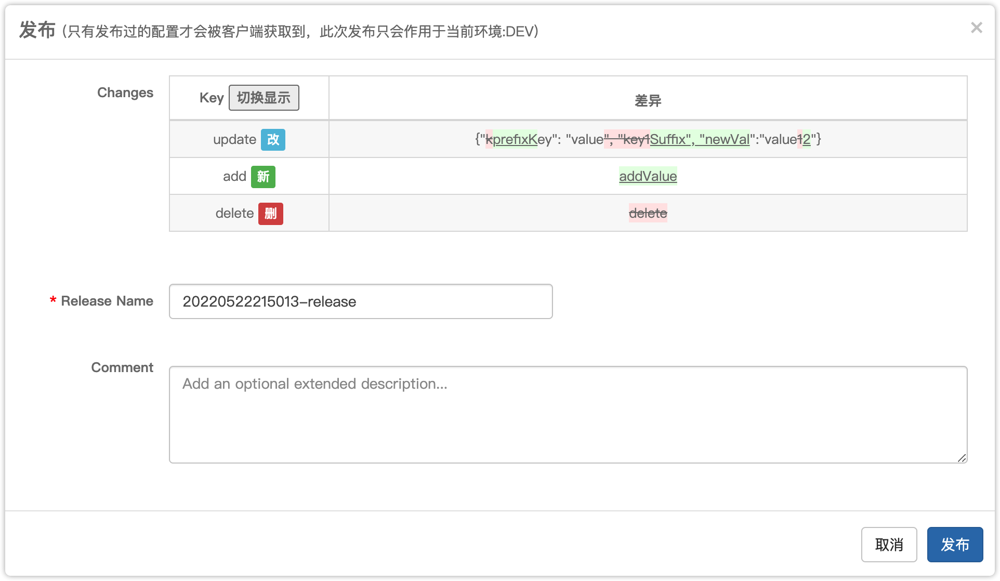
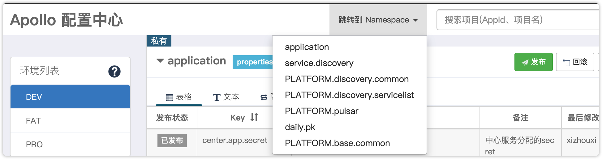

# apollo-enhance

> 优化旧版 apollo 管理台的使用 (基于 1.1.2)

## 安装

1. 浏览器安装 [tampermonkey](https://www.tampermonkey.net/) 插件 (若无法科学上网可以使用[离线下载](https://www.crx4.com/27046.html))
2. 点击 油猴插件图标 > 点击管理面板 > 选择实用工具 > 从 URL 安装 。
3. 输入  `https://raw.githubusercontent.com/xyz327/old-apollo-portal-enhance/main/tampermonkey-script.js`  安装

## 优化点

### 增加发布差异对比

### 增加跳转到指定 namespce

### 取消整体页面的nice-scroll

> 由于在使用 nice-scroll 后会导致`ctrl+F` 搜索内容后无法正确调整到指定位置
