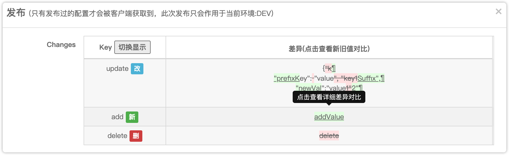

# apollo-enhance

> 对旧版本 apollo 控制台使用优化(基于 1.1.2)  .最好的方式还是修改服务端。  
> 这里只是面向于对于不能升级 apollo 版本并且无法修改源码的 apollo 管理台的使用者

- [apollo-enhance](#apollo-enhance)
  - [安装](#安装)
    - [从 greasyfork 安装](#从-greasyfork-安装)
    - [从 github 安装](#从-github-安装)
  - [优化点](#优化点)
    - [恢复浏览器 Ctrl+F 搜索跳转](#恢复浏览器-ctrlf-搜索跳转)
    - [增加跳转到指定 namespce](#增加跳转到指定-namespce)
    - [增加发布差异对比](#增加发布差异对比)
  
## 安装

1. 浏览器安装 [tampermonkey](https://www.tampermonkey.net/) 插件 (若无法科学上网可以使用[离线下载](https://www.crx4.com/27046.html))

### 从 greasyfork 安装

 1. 浏览器访问 [https://greasyfork.org/zh-CN/scripts/447045-apollo-enhance](https://greasyfork.org/zh-CN/scripts/447045-apollo-enhance) 
 2. 点击安装

### 从 github 安装

1. 点击 油猴插件图标 > 点击管理面板 > 选择实用工具 > 从 URL 安装 。
2. 输入  `https://raw.githubusercontent.com/xyz327/old-apollo-portal-enhance/main/tampermonkey-script.js`  安装

## 优化点

### 恢复浏览器 Ctrl+F 搜索跳转

> 由于在使用 nice-scroll 后会在 html 标签上增加 style="overflow:hidden" 从而导致`ctrl+F` 搜索内容后无法正确调整到指定位置

Apollo 1.2.0 移除了 nice-scroll [PR](https://github.com/apolloconfig/apollo/pull/1621)

### 增加跳转到指定 namespce

### 增加发布差异对比

